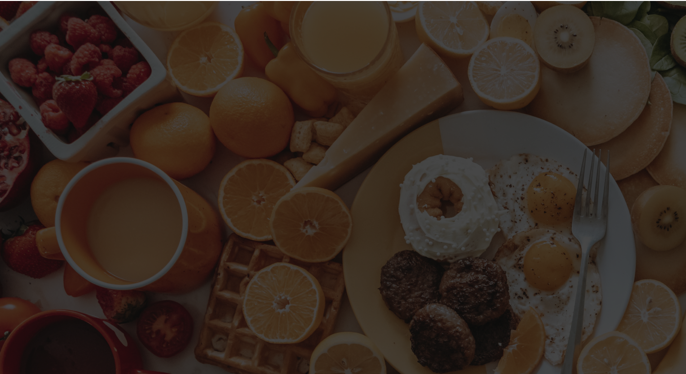

# FoodyZone

A full-stack food ordering application with a modern UI, built with React and Express.js. Browse food items by category, search by name, and view pricing — all in a sleek, responsive interface.



## Tech Stack

| Layer | Technology |
|-------|------------|
| Frontend | React 18, Vite, styled-components |
| Backend | Node.js, Express.js, TypeScript |
| Styling | styled-components (CSS-in-JS) |

## Project Structure

```
├── app/                  # Frontend (React + Vite)
│   ├── public/           # Static assets (images, icons)
│   └── src/
│       ├── components/   # React components
│       └── App.jsx       # Main application
├── server/               # Backend (Express + TypeScript)
│   ├── public/images/    # Food item images
│   └── src/
│       └── index.ts      # API server
└── README.md
```

## Getting Started

### Prerequisites

- [Node.js](https://nodejs.org/) (v16 or higher)
- npm

### Installation

1. **Clone the repository**

   ```bash
   git clone <repository-url>
   cd foody-zone
   ```

2. **Install server dependencies**

   ```bash
   cd server
   npm install
   ```

3. **Install app dependencies**

   ```bash
   cd app
   npm install
   ```

### Running the Project

Open two terminal windows:

**Terminal 1 — Start the backend server (port 9000):**

```bash
cd server
npm run build
npm start
```

For development with auto-reload:

```bash
cd server
npm run server
```

**Terminal 2 — Start the frontend dev server (port 5173):**

```bash
cd app
npm run dev
```

The app will be available at [http://localhost:5173](http://localhost:5173).

## API

The backend serves a single endpoint:

| Method | Endpoint | Description |
|--------|----------|-------------|
| GET | `/` | Returns all food items as JSON |

### Example Response

```json
[
  {
    "name": "Boilded Egg",
    "price": 10,
    "text": "Lorem ipsum dolor sit amet consectetur adipisicing elit.",
    "image": "/images/egg.png",
    "type": "breakfast"
  }
]
```

## Features

- **Category Filtering** — Filter food items by Breakfast, Lunch, or Dinner
- **Search** — Search food items by name in real-time
- **Responsive Design** — Adapts to mobile and desktop screens
- **Food Cards** — Displays food image, name, description, and price

## License

ISC
